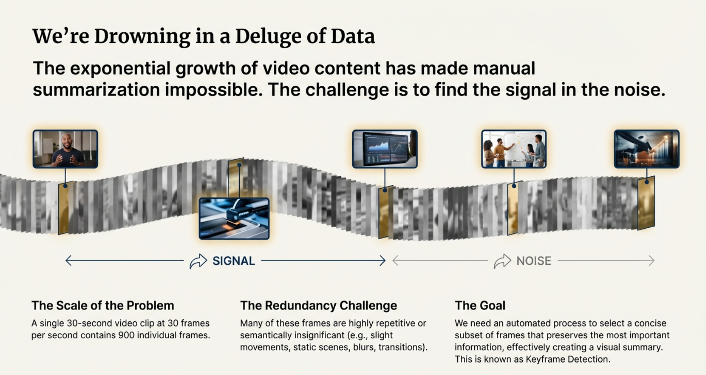
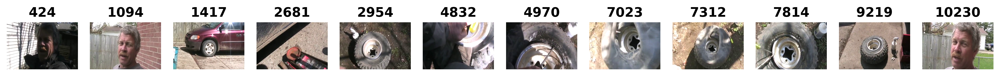
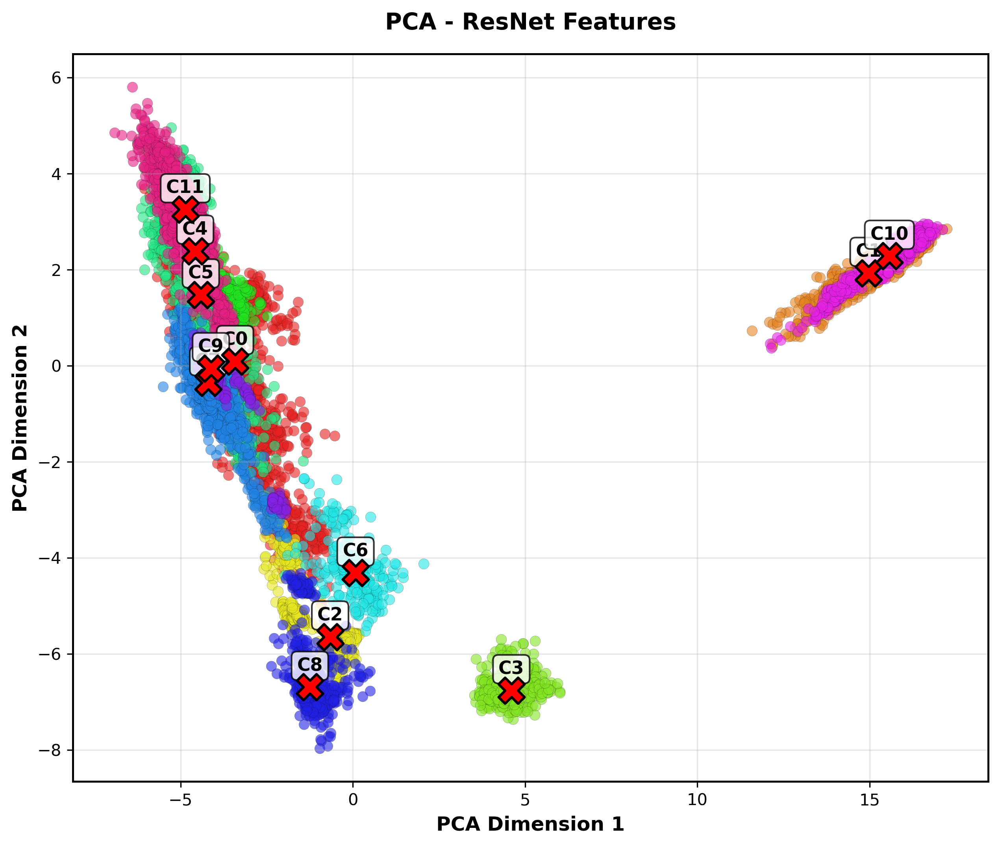
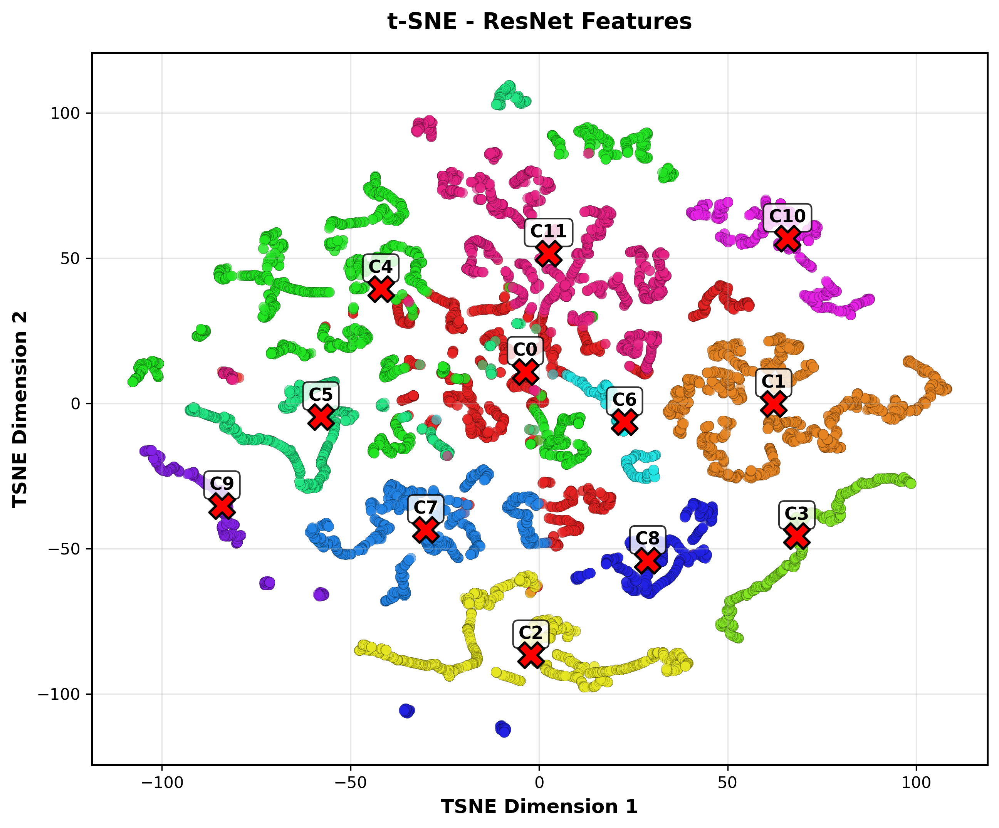
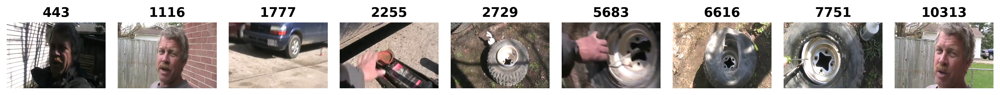
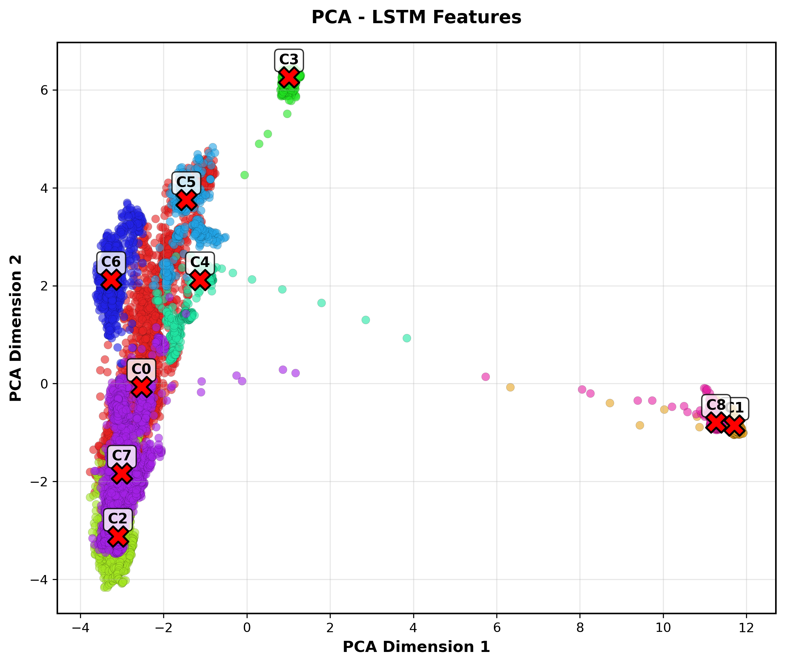
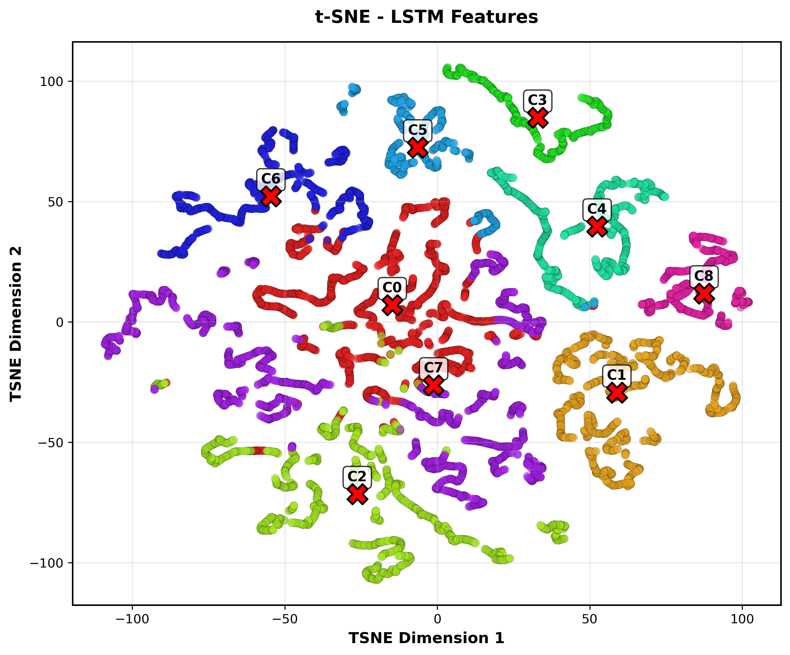
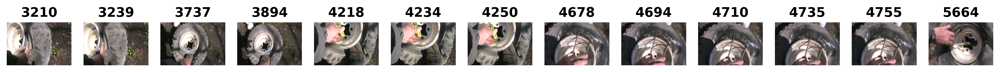

# Video Keyframes Extraction

This report provides a comprehensive overview of the Video Keyframes Extraction project, detailing the architecture, approaches, and visualization of the results. The goal of this project is to automatically extract representative keyframes from videos using various deep learning and clustering techniques.

## Project Architecture

The project is structured into a modular pipeline:
- **Feature Extraction:** Pre-trained Convolutional Neural Networks (e.g., ResNet) extract deep spatial features from video frames.
- **Summarization Models:** Three distinct models are implemented to process features and identify keyframes.
- **Visualization:** Dimensionality reduction techniques (PCA and t-SNE) combined with custom, dynamic color coding are used to visualize feature clusters.

---

## Approach 1: ResNet + K-Means Clustering (Unsupervised)

### Structure
This approach relies entirely on the spatial features extracted from individual video frames without modeling temporal dependencies.
1. **Feature Extraction:** Frames are passed through a ResNet model to obtain 2048-dimensional feature vectors.
2. **K Selection:** The optimal number of clusters ($K$) is determined using the Elbow Method. A geometric distance formulation is used to find the maximum perpendicular distance from the curve to the line connecting the start and end points of the inertias plot.
3. **Clustering:** K-Means clustering is applied. The frames closest to the cluster centroids are selected as the representative keyframes.

### Visualizations

#### Extracted Keyframes

#### Feature Projections (Clusters)

**PCA Projection:**

**t-SNE Projection:**

---

## Approach 2: LSTM Autoencoder + K-Means (Self-Supervised)

### Structure
To capture the temporal dynamics and sequence information of the video, an LSTM Autoencoder is introduced over the ResNet features.
1. **Sequence Modeling:** ResNet features are fed into a Bidirectional LSTM Autoencoder. The encoder compresses the temporal sequence into a dense representation, while the decoder attempts to reconstruct the original features.
2. **Feature Extraction:** The output of the LSTM encoder is used as the temporally-aware feature representation of each frame.
3. **Clustering:** Similar to the first approach, the Elbow Method determines the optimal $K$, and K-Means is used to cluster the LSTM-encoded features. Centroids dictate the keyframes.

### Visualizations

#### Extracted Keyframes

#### Feature Projections (Clusters)

**PCA Projection:**

**t-SNE Projection:**

---

## Approach 3: ResNet + Bi-LSTM + Human Annotations (Supervised)

### Structure
This approach leverages ground-truth annotations to directly learn which frames are the most important.
1. **Model Architecture:** A Bidirectional LSTM processes the ResNet features, followed by a Multi-Layer Perceptron (MLP) with Dropout and ReLU activations. The final layer uses a Sigmoid activation to output an "importance score" (between 0 and 1) for each frame.
2. **Training:** The model is trained using Mean Squared Error (MSE) loss against ground truth scores. 
3. **Keyframe Selection:** Frames with the highest predicted scores are selected. A minimum distance constraint (e.g., 15 frames) is enforced to ensure diversity and avoid selecting consecutive, redundant frames.

### Visualizations

#### Extracted Keyframes

---

## Conclusion

By modularizing the codebase, the project successfully implements and compares multiple keyframe extraction strategies. 
- **K-Means** provides a solid baseline relying purely on spatial similarity.
- The **LSTM Autoencoder** enhances the representation by incorporating temporal context, leading to potentially more coherent clusters.
- The **Supervised Model** directly targets human annotations, yielding the most targeted summaries when training data is available. 

The visualizations generated using robust PCA and t-SNE projections provide a clear understanding of how the features space is partitioned across different methodologies.
